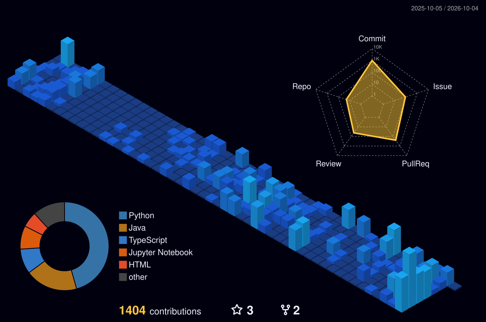

---

카카오테크캠퍼스에서 Java/Spring으로 팀 프로젝트를 했고 Python/FastAPI로는 혼자 설계부터 배포까지 해봤습니다. 요즘은 Temporal로 LLM 파이프라인 결과를 검증하는 과정을 자동화하는 데 관심이 많아서 개인 프로젝트에 직접 써보고 있습니다. 앞으로는 Celery 같은 분산 태스크 큐나 OpenTelemetry 같은 관측성 도구를 팀 단위 서비스에도 제대로 붙여보고 싶습니다.

## 🏢 [Team18_BE](https://github.com/kakao-tech-campus-3rd-step3/Team18_BE)

동아리 모집, 지원자 관리 서비스 [Dongariu-um](https://www.dongarium.co.kr/)의 백엔드입니다. Google Analytics 기준 누적 사용자 약 4,000여 명, 이벤트 약 13만 건이 기록된 서비스를 카카오테크캠퍼스에서 백엔드 3명, 프론트 3명이 1년째 만들고 있고 지금도 운영하고 있습니다. 저는 백엔드에서 지원서 제출 도메인의 API와 DB 모델링을 맡았고 통계와 공지는 처음부터 끝까지 혼자 만들었으며 이메일 알림도 대부분 제가 작성했습니다. 지원서 목록 조회가 느려서 join fetch와 프로젝션으로 쿼리를 줄였고, 이메일 발송은 이벤트로 분리해 재시도 가능한 실패와 아닌 실패를 나눠 처리했습니다. 장애를 바로 보려고 Prometheus, Grafana, Loki 모니터링을 팀에서 직접 붙였고, 테스트는 계층별로 299개를 쌓았습니다.

## 🎮 [vgc-ai](https://github.com/gary5876/vgc-ai)

IEEE CoG 2026 포켓몬 VGC AI 대회를 목표로 시작했지만 대회 제출은 하지 않은 게임 AI입니다. GCP VM에 코딩에이전트를 올려서 전략을 제안하게 하고, 자가대전 2000판으로 검증해 신뢰구간 기준을 통과한 것만 merge하는 방식으로 운영했습니다. 좋아 보이던 변경이 재검증에서 기각된 경우도 그대로 기록해 뒀습니다. 수업 내 25팀 리그전에서 1위를 했습니다.

## 📄 [study-helper](https://gary5876.github.io/portfolio/projects/study-helper/)

PDF를 올리면 LLM으로 학습 노트와 퀴즈를 만들어주는 서비스입니다. [백엔드](https://github.com/gary5876/study-helper-backend)(FastAPI)뿐 아니라 [웹](https://github.com/gary5876/study-helper-web)(Next.js)과 [모바일](https://github.com/gary5876/study-helper-mobile)(React Native) 클라이언트까지 세 레포 전부 혼자 만들었습니다. 백엔드는 Claude, GPT, TimelyGPT 세 개 LLM API를 연동하면서 프로바이더별로 서킷 브레이커를 붙여 장애를 격리했고, 사용자가 키를 잘못 넣은 401까지 장애로 세면 브레이커가 엉뚱하게 열리길래 그건 카운트에서 뺐습니다. 같은 PDF가 다시 오면 해시로 잡아서 LLM을 다시 안 부르고, 레이트리밋과 요청 추적, 메트릭까지 붙였습니다. Cloud Run에 키 없이 배포합니다.

그 외 RAG 서베이 논문을 정리한 [rag-survey-notes](https://github.com/gary5876/rag-survey-notes), 데이터 품질 점수로 ML 모델 성능을 예측해본 캡스톤 [capstone-dsc](https://github.com/gary5876/capstone-dsc)가 있습니다.

## 🎓 배경

카카오테크캠퍼스 백엔드 과정을 수료했습니다. [spring-gift](https://github.com/gary5876/spring-gift-order) 미션을 코드리뷰 받으며 진행했고 그 인연으로 Team18_BE까지 이어졌습니다. 학부는 인공지능학부고 AWS Certified Cloud Practitioner와 AI Practitioner를 갖고 있습니다.

---

## 📈 활동

<picture>
  <source media="(prefers-color-scheme: dark)" srcset="https://raw.githubusercontent.com/gary5876/gary5876/output/github-contribution-grid-snake-dark.svg" />
  
</picture>

